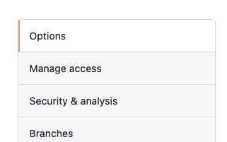
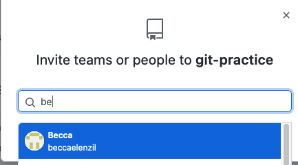
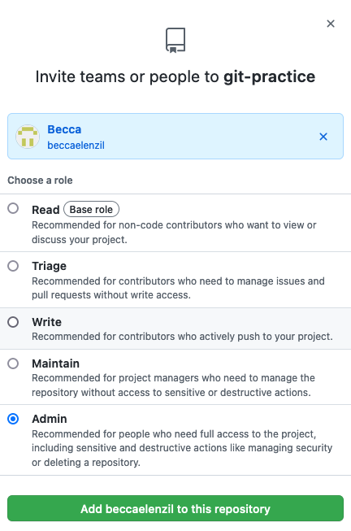
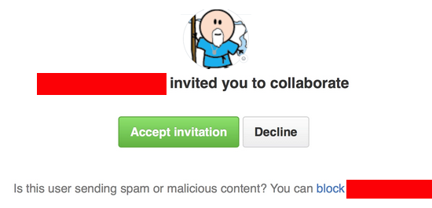

# Activity:  Using Git to Collaborate

## Goal

Previously we examined how you can use git to save our work progress by making commits saving changes to our code.  This has allowed us to back up our work in incremental changes both locally and on Github.  Now we will use git & Github to collaborate remotely.

## Things to Remember

* **Communicate** as a team on Zoom, ask each other for help
  * Remember you can share your screen to get help or demonstrate for your teammates.
* Ask for help via Slack, if needed, so your instructor can know to jump in and assist

## Activity Instructions

### Set Up the Repository

We will form into teams of 2-3 students.  **One** partner will fork and clone this repository.

1.  To fork the repository, verify that you are on the **Ada-CXX** repository (where XX is your cohort number), and click on the **Fork** button.
  
1.  Then go to the **Settings** and **Manage access**.
  
  
1.  Add your teammates as collaborators
  
  
1.  Each team member will get an email inviting them to the repository.  They should click on the accept link.
  

### Clone the Repository

Each team member should clone the repository to their local computer using:

```
$ git clone <URL>
```

Make sure you are cloning your **partner's** repository and **not** Ada's.

If you `cd` into the repository and type `git remote -v` you should see your partner's repo and **NOT** Ada-CXX.

### Step 1: Complete a Function

Each team member, A, B, and (maybe) C will complete the following functions and then add and commit the file.  

**function_a**

```python
def most_common_value(number_list):
    """ returns the most common element of the list
    """
    frequency_index = {}
    max_frequency = -1
    most_common_value = None
    for num in nums:
        if frequency_index.get(num):
            frequency_index[num] += 1
        else:
            frequency_index[num] = 1
        
        if max_frequency < frequency_index[num]:
            max_frequency = frequency_index[num]
            most_common_value = num
        
    return most_common_value
```

**function_b**

```python
def silly_sum():
    """ reads numbers from the user (use input_int) 
        summing as we go until either
        the user enters 0, or
        the sum reaches or exceeds 1000
    """
    num = int(input('Please enter a number => '))
    sum = 0

    while num != 0:
        sum += num
        num = int(input('Please enter a number => '))
    
    return sum
```

**function_c** - for 3-person teams

```python
def merge_lists(list_a, list_b):
    """ Returns a new list which is
        a combination of list_a and list_b
        without any duplicate elements.
    """
    return list(set(list_a) | set(list_b))
```

### Step 2: Add & Commit Your Function

Each team member should use:

```
$ git add <filename>
$ git commit -m "<COMMIT MESSAGE>"
``` 

This stages changes and saves the changes as a commit.  Use meaningful commit messages.

### Step 3: Push changes to Github

Each team member should then use:

```
$ git push
``` 

This sends the commit(s) to Github.

**🚨  Oh Snap!  🚨** One or more team members should get this message!

```
$ git push
To github.com:<Org-Name>/git-practice.git
 ! [rejected]        main -> main (fetch first)
error: failed to push some refs to 'github.com:<Org-Name>/git-practice.git'
hint: Updates were rejected because the remote contains work that you do
hint: not have locally. This is usually caused by another repository pushing
hint: to the same ref. You may want to first integrate the remote changes
hint: (e.g., 'git pull ...') before pushing again.
hint: See the 'Note about fast-forwards' in 'git push --help' for details.
```

This is because Github has commits not available locally.  One partner managed to push their commits before the others.

Github will not let the rest of the team push changes until they have merged their git history with what is already on github.

### Step 4:  Team members unable to push should pull

Each team member who was unable to push to github should instead **pull** the changes which are on github, but not available locally.

Notice we are following the directions git provides.

```
$ git pull
```

Everyone should verify that you have their teammate's function.  Then each remaining teammate should push their changes to github with:

```
$ git push
```

### Step 5:  Working on the Same Function

What about if multiple people write code on the same area of the same file?  

Each team member should complete the function in `function_d.py`.  Each team member should write their own solution.  

Then add, commit and push changes to Github using `git pull` if unable to push, like above.

At least one team member should get the following message.

```
$ git pull
 * branch            main       -> FETCH_HEAD
Auto-merging README.md
CONFLICT (content): Merge conflict in function_d.py
Automatic merge failed; fix conflicts and then commit the result.
```

This message occurs when git does not understand how to combine the changes.  This situation is called a **merge conflict**.  When you look at the code in VS Code it should look something like this.


### Step 6:  Using zoom screen sharing resolve the conflict

To resolve this merge conflict either click on the links in VS Code to accept _either_ the current or incomming change, or you can edit the code to combine the changes manually.

Make sure you can run the function when you finish.

### Step 7: Add and commit the resolution to the merge conflict

The team member who resolved the conflict can then add and commit the file and push the changes to github.

### Step 8:  Everyone pull the current remote repository

Lastly every team member should run `git pull` to retrieve the remote repository to their computer and verify that they have the same code on their computer.

## Questions to Answer

* How do git and Github allow us to collaborate on a project?
* What is a _merge conflict_?
